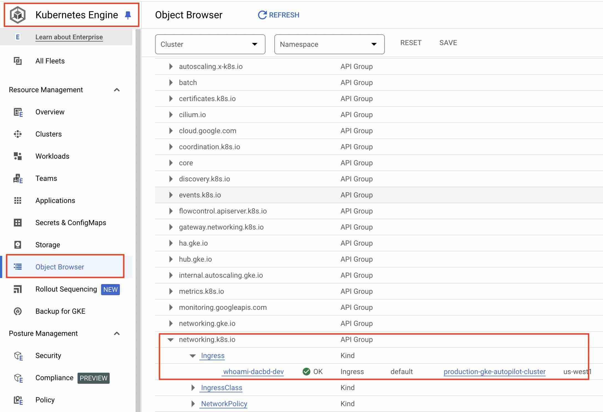
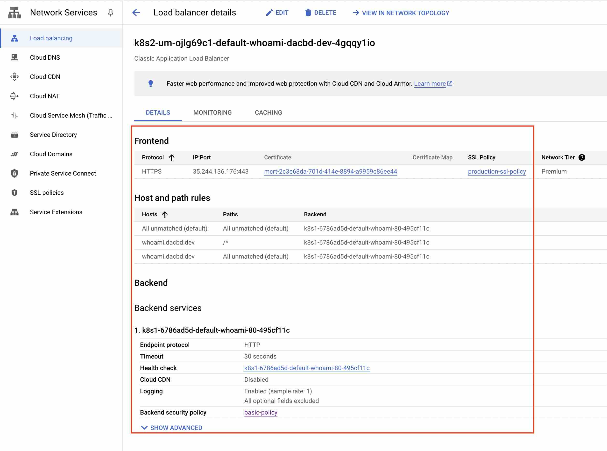

## Intro

Our goal is to go from nothing to a __basic__ production-ready deployment in GCP (from the perspective of a small team, Solo DevOps, or your side project that will totally get some traffic).

If you follow along you'll have a strong base to build and scale your application from.
We'll have a secure by default setup, ready for easy horizontal scaling.
We'll have easy-to-query/search logs to investigate production issues.
Finally, we'll have built-in performance monitoring for system metrics like RAM and CPU usage.
All with some basic configuration, and zero maintenance required from us.

I'm going to use the "production ready" term a little loosely, everyone has their definition of what that means.
We aren't going in-depth on every detail and depending on your risk tolerance/security posture there may be many more things you should do to be "production-ready".

That said, I'm confident for 80% of early projects this will get you all the way there, if not then at least 80% of the way.

All of the code is available [here](https://github.com/dacbd/zero-to-prod-gke).

## Tech Choices
I love automation and things that "just work" so, I have two __meta goals__ for our setup.

First, I want it to be easily reproducible with the least amount of click ops possible.
Second, it should be as hands-off as possible, set it and forget it.


We'll use Terraform to define our static infra.
GKE autopilot, to run our application.
Finally GCP's "Cloud Native" solution for Load Balancing, Logging, and Metrics.


With this approach, if something goes wrong we can delete our whole project and start from scratch, easily reproducing our exact setup.
Additionally, it should be hands off, we aren't going full *serverless*, but we don't want to worry about patching servers, or configuring [HAProxy](https://docs.haproxy.org/3.0/configuration.html).

## Getting Started

Make sure we have all of our required CLI tools.

[terraform:](https://developer.hashicorp.com/terraform/tutorials/aws-get-started/install-cli)
```bash
brew tap hashicorp/tap
brew install hashicorp/tap/terraform
```

[kubectl:](https://kubernetes.io/docs/tasks/tools/#kubectl)
```bash
# Probably best to use the kubectl provided by docker decktop
curl -LO "https://dl.k8s.io/release/$(curl -L -s https://dl.k8s.io/release/stable.txt)/bin/darwin/arm64/kubectl"
```

[gcloud:](https://cloud.google.com/sdk/docs/install#installation_instructions)
```bash
cd ~/
wget https://dl.google.com/dl/cloudsdk/channels/rapid/downloads/google-cloud-cli-darwin-arm.tar.gz
tar xzf ./google-cloud-cli-darwin-arm.tar.gz
./google-cloud-sdk/install.sh
# source your bashrc or open a new terminal
gcloud init

```

[gcloud k8s auth component:](https://cloud.google.com/blog/products/containers-kubernetes/kubectl-auth-changes-in-gke)
```bash
gcloud components install gke-gcloud-auth-plugin
```

## Terraform

In the [git repo](https://github.com/dacbd/zero-to-prod-gke/tree/main/terraform) you can see the whole terraform setup together.
As we progress I will show the relevant parts as they come up.

First, we need to get the boilerplate out of the way, we define the providers with need:
```hcl
terraform {
  required_providers {
    google = {
      source  = "hashicorp/google"
      version = "6.6.0"
    }
    cloudflare = {
      source  = "cloudflare/cloudflare"
      version = "~> 4.4"
    }
  }
}

provider "google" {
  project = var.project_id
  region  = var.region
}

provider "cloudflare" {
  api_token = var.cloudflare_api_token
}
```

If you have sensitive credentials, like `var.cloudflare_api_token` in the above you can use an environment variable to set the value so you aren't putting it in a file that might end up in git. 

Terraform will look for environment variables with the prefix: `TF_VAR_` and set their values to your variables.
Using our above example we can run `export TF_VAR_cloudflare_api_token=deadbeef`.

If the variable isn't sensitive, but might change still I would set a default value like so:
```hcl
variable "region" {
  description = "The region infra will be deployed in."
  type        = string
  default     = "us-west1"
}
```
This way its still configurable but you won't need to manage a long list of environment variables.


You can set your DNS records however you wish, I'm using cloudflare and it's terraform provider for DNS but it's not required.
Instead, you can copy-paste a few values to set your DNS records. (see the [git repo outputs for what to c/p](https://github.com/dacbd/zero-to-prod-gke/blob/main/terraform/output.tf))


If we are working in a brand new GCP project we will need to enable all the required services:
```hcl
module "project-services" {
  source  = "terraform-google-modules/project-factory/google//modules/project_services"
  version = "~> 17.0"

  project_id                  = var.project_id
  disable_services_on_destroy = false

  activate_apis = [
    "compute.googleapis.com",
    "iam.googleapis.com",
    "logging.googleapis.com",
    "container.googleapis.com",
    "certificatemanager.googleapis.com",
    "monitoring.googleapis.com",
  ]
}
```
If you get any `SERVICE_DISABLED` type error messages you may need to wait, enabling services is an ["eventually consistent"](https://registry.terraform.io/providers/hashicorp/google/latest/docs/guides/google_project_service#newly-activated-service-errors) process. [Module reference](https://github.com/terraform-google-modules/terraform-google-project-factory/tree/master/modules/project_services)

### Networking

Networking is often a source of pain, and it's important to try and get it right the first time.
If you get it wrong, in the wrong way, it might mean taking down all of your services to fix it.

So we are going to try and keep it simple.
To help with security, we will keep our network private.
For our app to call out to external services, we'll create a [Cloud Nat](https://cloud.google.com/nat/docs/overview).
The only way traffic can get onto our network will be through the GCP load balancer. *So*...

**NO Public IPs in our Network!**

Note that you can still get a shell on a k8s pod through the control plane, the ultra paranoid will set up a VPN on the network and configure the controal plane to only be accesible through the private network. I plan to write about that at some point...

On the Cloud Providers I use the most (AWS/GCP) setting up a network can be a bit tedious if you do it by hand, so I recommend using a premade terraform module to handle it: [AWS](https://github.com/terraform-aws-modules/terraform-aws-vpc)/[GCP](https://github.com/terraform-google-modules/terraform-google-network).


Without diving into a networking 101 class, here is some quick notes on cidr and subnets.
1. Just use the typical large private `10.0.0.0/8`/`10.x.x.x` address space. `192.168.0.0/16` is what most people's home networks use, `172.16.0.0/12` is what docker's networking typically uses. So this just avoids any confusion.
2. Just because you are using `10.0.0.0/8` style private network doesnt mean you should use big subnets.
3. Stick to `10.x.0.0/16` it should be more than enough IPs and gives you plenty of space to add a bunch of subnets.
4. If you need bigger subnets then you probably know what you are doing already...

Some other subnet chunks you can use:
- `10.x.x.0/24`
- `10.x.0.0/18`, `10.x.64.0/18`, `10.x.128.0/18`, and `10.x.192.0/18`

The latter we will use in our example below.


#### locals
```hcl
locals {
  cluster_type           = "production-gke-autopilot"
  network_name           = "production"
  subnet_name            = "k8s-private-subnet"
  master_auth_subnetwork = "k8s-private-master-subnet"
  pods_range_name        = "ip-range-pods-private"
  svc_range_name         = "ip-range-svc-private"
  subnet_names           = [for subnet_self_link in module.prod-vpc.subnets_self_links : split("/", subnet_self_link)[length(split("/", subnet_self_link)) - 1]]
}
```

#### vpc
```hcl
module "prod-vpc" {
  source  = "terraform-google-modules/network/google"
  version = ">= 7.5"

  project_id   = var.project_id
  network_name = local.network_name

  subnets = [
    {
      subnet_name           = local.subnet_name
      subnet_ip             = "10.1.0.0/16"
      subnet_region         = var.region
      subnet_private_access = true
    },
    {
      subnet_name   = local.master_auth_subnetwork
      subnet_ip     = "10.2.0.0/16"
      subnet_region = var.region
    },
  ]

  secondary_ranges = {
    (local.subnet_name) = [
      {
        range_name    = local.pods_range_name
        ip_cidr_range = "10.3.0.0/18"
      },
      {
        range_name    = local.svc_range_name
        ip_cidr_range = "10.3.64.0/18"
      },
    ]
  }
}

```

#### Cloud Nat
We want to reach out to greater internet from our  private cluster so we need a [Cloud Nat](https://cloud.google.com/nat/docs/gke-example)
```hcl
resource "google_compute_router" "router" {
  name    = "nat-router"
  network = module.prod-vpc.network_name
  region  = var.region
}

resource "google_compute_router_nat" "nat" {
  name                               = "nat"
  router                             = google_compute_router.router.name
  region                             = google_compute_router.router.region
  nat_ip_allocate_option             = "AUTO_ONLY"
  source_subnetwork_ip_ranges_to_nat = "ALL_SUBNETWORKS_ALL_IP_RANGES"

  log_config {
    enable = true
    filter = "ERRORS_ONLY"
  }
}
```

### K8s Cluster
One option for creating the k8s cluster would be to use another [terraform module](https://github.com/terraform-google-modules/terraform-google-kubernetes-engine) like we did for networking, so take a look at their examples and see if one makes what you are going for.

Here I have crafted an Autopilot cluster that matches what is created if you click through the web console to create a private cluster.

<details><summary>The terraform definition is a bit long so click to expand.</summary>

```hcl
resource "google_container_cluster" "primary" {
  name              = "${local.cluster_type}-cluster"
  project           = var.project_id
  location          = var.region
  datapath_provider = "ADVANCED_DATAPATH"

  deletion_protection = false
  enable_autopilot    = true

  enable_cilium_clusterwide_network_policy = false
  enable_kubernetes_alpha                  = false
  enable_l4_ilb_subsetting                 = false
  enable_legacy_abac                       = false
  enable_multi_networking                  = false
  enable_tpu                               = false

  network         = "projects/${var.project_id}/global/networks/${module.prod-vpc.network_name}"
  networking_mode = "VPC_NATIVE"
  subnetwork      = "projects/${var.project_id}/regions/${var.region}/subnetworks/${local.subnet_names[index(module.prod-vpc.subnets_names, local.subnet_name)]}"

  ip_allocation_policy {
    cluster_secondary_range_name  = local.pods_range_name
    services_secondary_range_name = local.svc_range_name
    stack_type                    = "IPV4"
    pod_cidr_overprovision_config {
      disabled = false
    }
  }

  addons_config {
    gce_persistent_disk_csi_driver_config {
      enabled = true
    }
    gcp_filestore_csi_driver_config {
      enabled = true
    }
    gcs_fuse_csi_driver_config {
      enabled = true
    }
    horizontal_pod_autoscaling {
      disabled = false
    }
    http_load_balancing {
      disabled = false
    }
    ray_operator_config {
      enabled = false
    }
  }

  binary_authorization {
    evaluation_mode = "DISABLED"
  }

  cluster_autoscaling {
    auto_provisioning_locations = []
    autoscaling_profile         = "OPTIMIZE_UTILIZATION"

    auto_provisioning_defaults {
      image_type = "COS_CONTAINERD"
      oauth_scopes = [
        "https://www.googleapis.com/auth/devstorage.read_only",
        "https://www.googleapis.com/auth/logging.write",
        "https://www.googleapis.com/auth/monitoring",
        "https://www.googleapis.com/auth/service.management.readonly",
        "https://www.googleapis.com/auth/servicecontrol",
        "https://www.googleapis.com/auth/trace.append",
      ]
      service_account = "default"

      management {
        auto_repair  = true
        auto_upgrade = true
      }
    }
  }

  default_snat_status {
    disabled = false
  }

  dns_config {
    cluster_dns        = "CLOUD_DNS"
    cluster_dns_domain = "cluster.local"
    cluster_dns_scope  = "CLUSTER_SCOPE"
  }

  gateway_api_config {
    channel = "CHANNEL_STANDARD"
  }

  logging_config {
    enable_components = [
      "SYSTEM_COMPONENTS",
      "WORKLOADS",
    ]
  }

  monitoring_config {
    enable_components = [
      "SYSTEM_COMPONENTS",
      "STORAGE",
      "POD",
      "DEPLOYMENT",
      "STATEFULSET",
      "DAEMONSET",
      "HPA",
      "CADVISOR",
      "KUBELET",
    ]

    advanced_datapath_observability_config {
      enable_metrics = true
      enable_relay   = false
    }

    managed_prometheus {
      enabled = true
    }
  }

  node_pool_defaults {
    node_config_defaults {
      insecure_kubelet_readonly_port_enabled = "FALSE"
      logging_variant                        = "DEFAULT"

      gcfs_config {
        enabled = true
      }
    }
  }

  private_cluster_config {
    enable_private_endpoint = false
    enable_private_nodes    = true

    master_global_access_config {
      enabled = false
    }
  }

  secret_manager_config {
    enabled = false
  }
  security_posture_config {
    mode               = "BASIC"
    vulnerability_mode = "VULNERABILITY_DISABLED"
  }
  vertical_pod_autoscaling {
    enabled = true
  }
  workload_identity_config {
    workload_pool = "${var.project_id}.svc.id.goog"
  }

  release_channel {
    channel = "REGULAR"
  }
}
```

</details>

### LoadBalancer
GKE Clusters come pre-setup to handle several Custom Resources which allow you to define certain parts of our infra with `kubectl`.
Our load balancer is an example of that.
We will go over part of it later with k8s manifests.
There are a few more static elements we need to define first through terraform, like DNS and some basic security rules.

#### LB SSL policy
Our LB is going to terminate SSL for us and we can configure which TLS versions are allowed, nothing special here:
```hcl
resource "google_compute_ssl_policy" "prod-ssl-policy" {
  name    = "production-ssl-policy"
  profile = "MODERN"
}
```

#### Static IP assigned to our LB
We will use a static IP address for our load balancer, we will also use this when we set up our DNS records.
```hcl
resource "google_compute_global_address" "static" {
  name         = "prod-lb-address"
  description  = "static IP address for whoami.dacbd.dev"
  address_type = "EXTERNAL"
}
```

#### A DNS "Authorization"
This is used later when we provision an SSL cert for our ingress resource/LB later in the kubectl manifests.
It essentially proves to GCP that we do own the domain. (make sure you add your domain here)
```hcl
resource "google_certificate_manager_dns_authorization" "default" {
  name        = "whoami-dacbd-dev-dns-auth"
  location    = "global"
  description = "The default dns"
  domain      = "whoami.dacbd.dev"
}
```

#### Your DNS records
We have two DNS records to set, one for our future LB's IP address, and another for the DNS authorization from above.
You can easily copy and paste these values into the records yourself, defining some outputs to print to your screen after you run apply:
```hcl
output "k8s_ingress_lb_global_static_ip" {
  value = google_compute_global_address.static.name
}

output "dns_record_domain_name" {
  value = google_certificate_manager_dns_authorization.default.dns_resource_record.0.name
}

output "dns_record_type" {
  value = google_certificate_manager_dns_authorization.default.dns_resource_record.0.type
}

output "dns_record_value" {
  value = google_certificate_manager_dns_authorization.default.dns_resource_record.0.data
}
```

You can also define these with Terraform too, I'm using Cloudflare so it looks like this:
```hcl
resource "cloudflare_record" "load-balancer-entry" {
  zone_id = var.cloudflare_zone_id
  name    = "whoami.dacbd.dev"
  content = google_compute_global_address.static.address
  type    = "A"
  ttl     = 1 # automatic
}

resource "cloudflare_record" "gcp-dns-authorization-entry" {
  zone_id = var.cloudflare_zone_id
  name    = google_certificate_manager_dns_authorization.default.dns_resource_record.0.name
  content = google_certificate_manager_dns_authorization.default.dns_resource_record.0.data
  type    = google_certificate_manager_dns_authorization.default.dns_resource_record.0.type
  ttl     = 1 # automatic
}
```

#### Some basic Load Balancer security
GCP's rules can be pretty expressive so it is definitely worth reading their docs or clicking around their wizard for manually adding rules.

Here I'd show some baseline rules, blocking countries and rate limiting.

You can define the rules together with the basic policy as a single resource, but I recommend keeping them seperate.
```hcl
resource "google_compute_security_policy" "default" {
  name        = "basic-policy"
  description = "basic global security policy"
  type        = "CLOUD_ARMOR"
}
```

Next our country block. 
Let's block Iran and North Korea. 
To elaborate on the example, you might not want to do business with sanctioned countries.

An additional consideration for the more paranoid is to track blocks that contain your auth header, A bad actor who is normally using a VPN might forget now and then.
```hcl
resource "google_compute_security_policy_rule" "block_country" {
  security_policy = google_compute_security_policy.default.name
  priority        = "1000"
  action          = "deny(403)"

  match {
    expr {
      expression = "origin.region_code == \"IR\" || origin.region_code == \"KP\""
    }
  }
}
```

Finally, we want some basic protection against DDOS on our app.

Note:
- This isn't the end-all-be-all of DDOS protection.
- It's not a substitute for rate-limiting being built into your app. 
- Your app level rate-limiting you can have more control and fine-tuning.
```hcl
resource "google_compute_security_policy_rule" "rate_limit" {
  security_policy = google_compute_security_policy.default.name
  priority        = "2000"
  action          = "rate_based_ban"

  match {
    versioned_expr = "SRC_IPS_V1"
    config {
      src_ip_ranges = ["*"]
    }
  }

  rate_limit_options {
    ban_duration_sec = 3600 # ban for an hour
    conform_action   = "allow"
    exceed_action    = "deny(429)"

    rate_limit_threshold {
      count        = 120
      interval_sec = 60
    }
  }
}
```

### Logging

Logging is pretty simple with our GKE setup, we don't need to do much.
No need to setup something like a fluentd DeamonSet, GCP **automagicly** collects our container logs for us.
We just need to create a separate logging bucket and set up the logging sink (to that bucket).
After that is complete you can just use GCP Log Explorer to inspect and query your logs.

First, we will create a random `bucket_prefix` destroying s3-type buckets is not an action that is completed immediately. If you are testing things running `terraform apply` and `terraform destroy` more than once you can get name conflicts.
```hcl
resource "random_string" "bucket_prefix" {
  length  = 6
  special = false
  upper   = false
}
```

Next, we create our special logging bucket (different from a normal cloud storage bucket).
```hcl
resource "google_logging_project_bucket_config" "k8s-logs" {
  project          = var.project_id
  location         = var.region
  retention_days   = 21
  enable_analytics = true
  bucket_id        = "${random_string.bucket_prefix.result}-${google_container_cluster.primary.name}-logs"
}
```

Finally, we create our logging sink, defining what logs we want and where they should go.
We are going to include an exclusion to help keep the total log volume down, you can remove it if you want to keep logs from the `kube-system` namespace. 
```hcl
resource "google_logging_project_sink" "k8s-sink" {
  name        = "${google_container_cluster.primary.name}-logs-sink"
  destination = "logging.googleapis.com/projects/${var.project_id}/locations/${var.region}/buckets/${google_logging_project_bucket_config.k8s-logs.bucket_id}"

  filter = <<-EOF
    resource.type="k8s_container"
    logName=("projects/${var.project_id}/logs/stderr" OR "projects/${var.project_id}/logs/stdout")
  EOF

  exclusions {
    name   = "remove-kube-system"
    filter = "resource.labels.namespace_name=\"kube-system\""
  }
}
```

## Kubernetes manifests for GKE
Now we'll review the basic definitions of resources to use everything we set up from above.

It's worth noting there are several ways to manage the deployment of your application.
For my example I'm going to reference the "raw yaml", but you could manage this with the [kubernetes terraform provider](https://registry.terraform.io/providers/hashicorp/kubernetes/latest/docs).

From my experience, I have yet to work on a project where we managed our app deployments with the Kubernetes provider, and my take would be: only do this if you want to strongly link all of your infra together.
If you do this approach you will likely want to avoid [CRD's](https://kubernetes.io/docs/concepts/extend-kubernetes/api-extension/custom-resources/) that create cloud infra for you, that way everything is defined in terraform.

To Give a brief summary, in my opinion: 
- use Terraform for strong coupling and a single source of truth.
- use raw yaml to keep things simple when things are simple
- use [helm](https://helm.sh) for all over cases. 

Finally, note that [ArgoCD](https://argo-cd.readthedocs.io/en/stable/) is the industry standard for git-based k8s automation, and it works best with raw yaml/[kustomize](https://kustomize.io) and helm. Look out for future posts on setting up ArgoCD!


### Deployment
Our Deployment yml is nothing special...
```yml
apiVersion: apps/v1
kind: Deployment
metadata:
  name: whoami
  labels:
    app: whoami
spec:
  replicas: 3
  selector:
    matchLabels:
      app: whoami
  template:
    metadata:
      labels:
        app: whoami
    spec:
      nodeSelector:
        cloud.google.com/gke-spot: "true"
      containers:
        - name: whoami
          image: ghcr.io/dacbd/whoami:latest
          ports:
            - containerPort: 3000
          resources:
            limits:
              cpu: 100m
              memory: 128Mi
            requests:
              cpu: 100m
              memory: 128Mi
          livenessProbe:
            periodSeconds: 10
            initialDelaySeconds: 5
            httpGet:
              path: /health
              port: 3000

```
I've included GKE Autopilot's version of Spot instances, which can give you a pretty solid discount.
The simplest form of usage is with the `nodeSelector` like I have here, but you can get some more control with their `affinity` rules.
You will want to make sure you have something to set up to handle when these Spot instances aren't available though.

- https://cloud.google.com/kubernetes-engine/docs/how-to/autopilot-spot-pods
- https://cloud.google.com/kubernetes-engine/pricing#autopilot_mode


### Service
Our service config is nothing special, we have two additional required annotations with our setup.
1. `cloud.google.com/neg`: in GKE the term `NEG` stands for ["network endpoint group"](https://cloud.google.com/kubernetes-engine/docs/concepts/container-native-load-balancing) if you are familiar with Cloud Load balancers or GCP's version of them, then you know you need to configure some kind of target grouping for the Load Balancer to send traffic to. This annotation creates this for you, targeting your service.  You can read more about [GKE's "Container-Native Load Balancing"](https://cloud.google.com/kubernetes-engine/docs/how-to/container-native-load-balancing#create_service).
2. `cloud.google.com/backend-config`: Simply connects our `BackendConfig` (covered next) to our service.

```yml
apiVersion: v1
kind: Service
metadata:
  name: whoami
  annotations:
    cloud.google.com/neg: '{"ingress": true}'
    cloud.google.com/backend-config: '{"default": "whoami-backend-config"}'
spec:
  type: ClusterIP
  selector:
    app: whoami
  ports:
    - name: http
      protocol: TCP
      port: 80
      targetPort: 3000
```

### Ingress
In our example we are going to define a few resources in our [`ingress.yml`](https://github.com/dacbd/zero-to-prod-gke/blob/main/kubernetes/ingress.yml) these could easily be seperate but they are pretty tightly coupled and in our example pretty short.
I'll go over these custom resources, but [when in doubt check the docs](https://cloud.google.com/kubernetes-engine/docs/how-to/ingress-configuration#overview).

#### FrontendConfig
`FrontendConfig` helps define the "entry point" to our load balancer, here we put the name of our SSL Policy we defined in Terraform.
We also add the entries so that we can redirect any HTTP to HTTPS. It's pretty simple, enabled or not, and what type of redirect status we want to use.

NOTE: if you are discussing your infra with someone besure to establish context, a "Frontend Config" might mean something very different to a web dev.
```yml
apiVersion: networking.gke.io/v1beta1
kind: FrontendConfig
metadata:
  name: frontend-config
spec:
  sslPolicy: production-ssl-policy
  redirectToHttps:
    enabled: true
    responseCodeName: MOVED_PERMANENTLY_DEFAULT
```

#### BackendConfig
The `BackendConfig` can be thought of as a target group, where your load balancer routes requests. Here I have defined it in my ingress yaml, but likely you have a `BackendConfig` for every `Service` you have defined (assuming all of your services have routes that will get exposed).
Our `BackendConfig` is also where we attach our security policy(LB level rate-limiting/blocking) we made in Terraform.
For a more holistic example we have redefined the `healthCheck` by default it makes requests to `/` of the `Service` attached to the `BackendConfig`.
The load balancer uses this to know which pods are healthy to route requests to.
```yml
apiVersion: cloud.google.com/v1
kind: BackendConfig
metadata:
  name: whoami-backend-config
spec:
  securityPolicy:
    name: basic-policy
  healthCheck:
    checkIntervalSec: 15
    timeoutSec: 2
    healthyThreshold: 1
    unhealthyThreshold: 3
    requestPath: /health
```
#### ManagedCertificate
Next our `ManagedCertificate` IMO the less I have to do to handle SSL the better, so I've opted for [GCP's managed certs](https://cloud.google.com/load-balancing/docs/ssl-certificates/google-managed-certs).
If you have done all the DNS leg work in our terraform from earlier this should just work.
From my testing, it seems to take about 5-10 minutes.
If your [provisioning has failed](https://cloud.google.com/load-balancing/docs/ssl-certificates/troubleshooting#certificate-managed-status) the most common reason is probably going to be `FAILED_NOT_VISIBLE` at which point you should check your k8s yaml and your DNS records for any typos.
```yml
apiVersion: networking.gke.io/v1
kind: ManagedCertificate
metadata:
  name: managed-cert
spec:
  domains:
    - whoami.dacbd.dev
```
#### Ingress
In our example, the [ingress](https://kubernetes.io/docs/concepts/services-networking/ingress/) definition is what ties everything together. The [spec is pretty standard](https://kubernetes.io/docs/reference/kubernetes-api/service-resources/ingress-v1/) so we won't cover it.
To walk through the annotations:
1. `kubernetes.io/ingress.class` tells k8s which ingress we are going to use, as a counter-example you might see the value as `nginx`
2. `kubernetes.io/ingress.global-static-ip-name` will attach our load balancer to the static IP we provisioned in Terraform
3. `networking.gke.io/managed-certificates` will attach our managed certificate so we can have proper/easy HTTPS for our LB
4. `networking.gke.io/v1beta1.FrontendConfig` essentially defines the entry point for our LB which we [covered above](#FrontendConfig)
```yml
apiVersion: networking.k8s.io/v1
kind: Ingress
metadata:
  name: whoami-dacbd-dev
  annotations:
    kubernetes.io/ingress.class: "gce"
    kubernetes.io/ingress.global-static-ip-name: prod-lb-address
    networking.gke.io/managed-certificates: managed-cert
    networking.gke.io/v1beta1.FrontendConfig: "frontend-config"
spec:
  defaultBackend:
    service:
      name: whoami
      port:
        number: 80
  rules:
    - host: whoami.dacbd.dev
      http:
        paths:
          - pathType: Prefix
            path: "/"
            backend:
              service:
                name: whoami
                port:
                  number: 80
```

## Wrap up and notes


### Running the complete project

If you are using the [repo](https://github.com/dacbd/zero-to-prod-gke) as a template and have updated all the variables for your use, then it should be as easy as this:
```bash
# from the respective directories
terraform init
terraform apply
gcloud container clusters get-credentials $CLUSTER_NAME --region $REGION --project $PROJECT_ID
kubectl apply -f .
# monitor k8s progress
k9s
```

### Leaving things partially complete
Try not to leave things haftway applied.
The biggest item I'll point out is that we provision a public static IP address to attach to the Load Balancer.
Until you apply the k8s yaml this address is considered detached, and GCP will charge you extra [(x2)](https://cloud.google.com/vpc/network-pricing#ipaddress). In the grand scheme it's not that much, but worth noting for our penny pinchers.

### Deleting/Cleaning up resources

Since some of the cloud infrastructure(the load balancer) is managed via Kubernetes resources, if you delete the cluster before deleting those resources, you will leave your account with resources that will need manual management.

__SO__ run `kubectl delete -f .` before running `terraform destroy` and be sure to give it some extra time, go make a coffee or take a nice walk.

Terraform can help with this footgun if you include a [lifecycle hook](https://developer.hashicorp.com/terraform/language/meta-arguments/lifecycle), you could setup some advanced [precoditions](https://developer.hashicorp.com/terraform/language/meta-arguments/lifecycle#custom-condition-checks) to help but that beyond this tutorial.
A basic lifecycle hook to help you would be something like this:
```hcl
resource "google_container_cluster" "primary" {
  # ...
  # ...
  lifecycle {
    prevent_destroy = true
    # ensure all cluster deployments and resources are deleted first
  }
}
```


In addition, the kubectl interface doesn't always provide you with clear insight into what is happening.
So if you navigate to your GKE cluster object browser to get links to all of the k8s managed resources.
https://console.cloud.google.com/kubernetes/object/browser


#### Example Images

<details><summary>The Object Browser Load Balancer</summary>


</details>

<details><summary>Our Ingress Object</summary>


</details>

<details><summary>Our Load Balancer</summary>


</details>


### Using k8s

If you are using multiple k8s clusters, for any number of reasons, always ensure you are accessing the correct one.
Run `kubectl config current-context` and make sure that matches what you expect.
If it's not you can run `kubectl config get-contexts` and then run `kubectl config set current-context <context name you want>`
You can also prefix all of your commands, for example `kubectl --context docker-desktop apply -f deployment.yml`


Finally, I highly recommend using [k9s](https://k9scli.io/topics/install/) for doing anything other than `apply` or `delete`
It is a great tool, use it. (contexts work the same with k9s to so you can run `k9s --context docker-desktop`)
